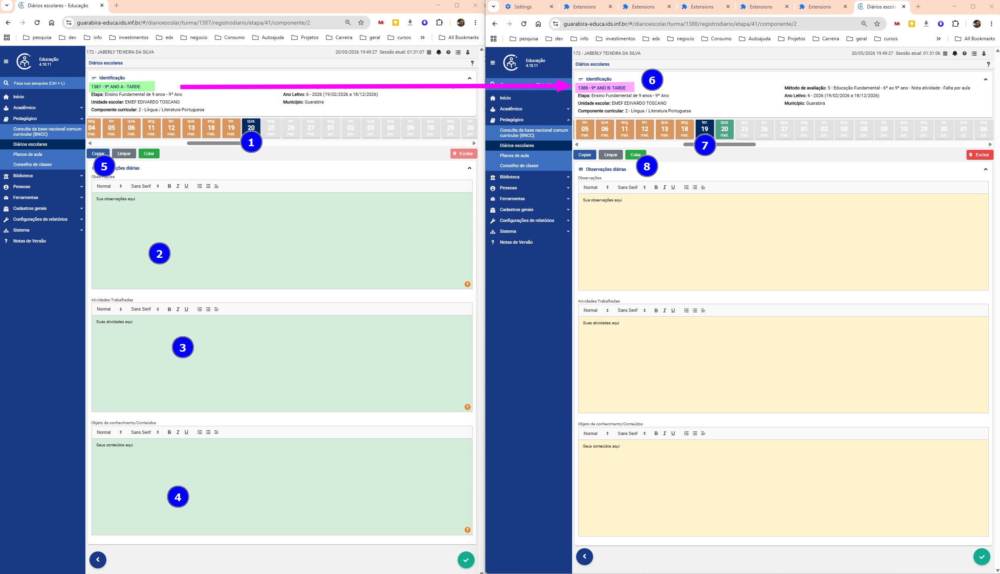
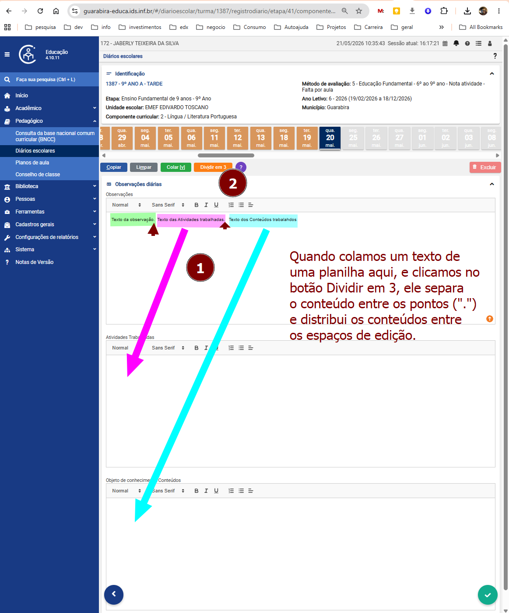
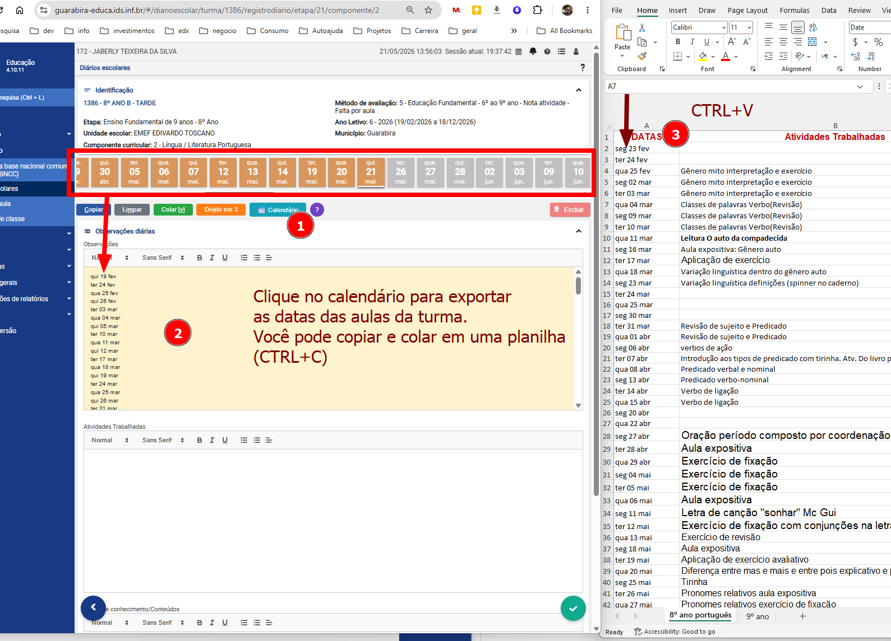

# Ajuda — Guarabira Educa

A extensão **Guarabira Educa** adiciona botões extras na página de registro diário para agilizar o preenchimento de turmas.

## Instalação

1. Acesse a página da extensão na Chrome Web Store:
   **https://chromewebstore.google.com/detail/guarabira-educa/plccgpkejnhojjlehlmgokgekdnlimmh**
2. Clique em **Adicionar ao Chrome**.
3. Confirme clicando em **Adicionar extensão**.
4. Pronto! A extensão estará ativa automaticamente ao acessar o Guarabira Educa.

> A extensão funciona apenas no site **guarabira-educa.ids.inf.br**.

> Do mesmo criador da extensão [Saber PB](https://chromewebstore.google.com/detail/saber-pb/pfnoopdjbdpgegpkihfmlofngfdkjfem).

---

## Botões


| Botão | Atalho | Descrição |
|-------|--------|-----------|
| **Copiar** | ALT+C | Salva o conteúdo dos três campos (Observações, Atividades, Conteúdos) |
| **Limpar** | ALT+M | Apaga o conteúdo salvo |
| **Colar** | ALT+V | Cola o conteúdo salvo nos três campos |
| **Dividir em 3** | ALT+I | Divide automaticamente o texto do primeiro campo em três partes |
| **📅 Calendário** | — | Extrai todas as datas do calendário escolar e insere no campo Observações, uma por linha |

---

## Como utilizar

### Replicar o mesmo registro em várias turmas



1. Preencha normalmente os campos de um registro diário.
2. Clique em **Copiar** (ou ALT+C) — os campos ficam com fundo **verde** confirmando o salvamento.
3. Abra outra JANELA, Navegue para o registro diário de outra turma. Você ficará com as duas janelas abertas.
4. Clique em **Colar** (ou ALT+V) na outra turma — os campos ficam com fundo **amarelo** confirmando o preenchimento.
5. Repita o passo 3 e 4 para quantas turmas desejar.
6. Caso se perca, clique em **Limpar** (ou ALT+M) para apagar o conteúdo copiado da memória.

---

### Dividir um texto longo em três partes



Use esse recurso quando você tiver um texto com três frases separadas por ponto (`.`) e quiser distribuí-las automaticamente nos três campos do registro.

1. Cole o texto completo no **primeiro campo** (Observações). Exemplo:
   > Explorou recursos naturais do município. Realizou atividades em grupo. Identificou elementos da paisagem local.
2. Clique em **Dividir em 3** (ou ALT+I).
3. Cada frase é distribuída automaticamente: a 1ª no campo Observações, a 2ª em Atividades, a 3ª em Conteúdos.

> **Atenção:** o texto é dividido pelo caractere `.` (ponto final). Certifique-se de que cada parte termina com ponto antes de usar o botão.

---

### Inserir as datas do calendário no campo Observações



Use esse recurso para preencher o campo Observações com todas as datas do calendário escolar listadas na página.

1. Certifique-se de que o campo **Observações** está vazio.
2. Clique em **📅 Calendário**.
3. O campo Observações será preenchido com uma data por linha, no formato:
   ```
   seg 23 fev
   ter 24 fev
   qua 25 fev
   ...
   ```
4. O mesmo conteúdo é copiado automaticamente para a área de transferência.

> **Atenção:** se o campo Observações não estiver vazio, a extensão exibirá uma mensagem de erro e não fará nenhuma alteração.

---

## Dicas

- O conteúdo salvo pelo **Copiar** fica disponível mesmo ao navegar entre páginas, até você clicar em **Limpar**.
- Use os atalhos de teclado para agilizar ainda mais: ALT+C, ALT+V, ALT+M, ALT+I.
- O botão **Salvar** da plataforma também ganhou o atalho **ALT+S**.
